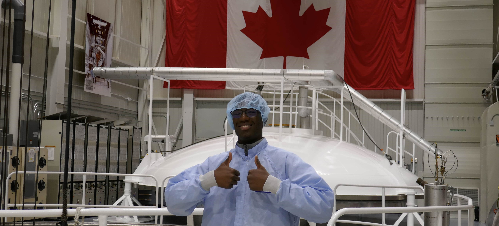

# What’s Up,  I’m Josué! ✌🏿 

  

## 📝 About Me  
🎓 5th-Year Computer Engineering Student @uOttawa  
🚗 Passionate about automotive systems, robotics, and embedded technologies  
🌱 Currently seeking internships or full-time roles in automotive. Looking at you [Tesla](https://www.tesla.com/careers)! 👀  
🎧 Huge **Nas** fan! *“The World Is Yours” stays on repeat*  

### 🛠️ I Worked at  

  

### 🔗 Connect with Me  
  

## ⚙️ Tech Stack  

## 🛠️ Featured Projects

⚡ [**EV Power Management Research**](https://github.com/JDazogbo/VehicleControl)  
Developed adaptive energy management controllers for electric vehicles using MATLAB, Simulink, and CarSim to optimize power consumption under varying and uncertain road conditions. Implemented advanced control strategies such as Linear Quadratic Regulator (LQR) to improve traction, stability, and energy efficiency.  
🖥 *MATLAB, Simulink, Control Theory*

🚁 [**TAILS Embedded System**](https://github.com/FreddyyAndrews/TAILS-Embedded)  
Designed, coordinated and implemented the embedded firmware for the Tactical Aerial Insight and Localization Suite (TAILS) Point-of-Interest detection system, enabling real-time drone telemetry, GPS tracking, and AI-powered object detection using a Heltec WiFi LoRa 32 board. Developed reliable LoRa communication protocols and sensor interfacing for autonomous aerial surveillance applications.  
🖥 *C++, Arduino, ESP32, LoRa, GPS, Artificial Intelligence*

🔦 [**Leddar Vu8 LiDAR Object Detection and Range Evaluation for UAV Applications**](https://github.com/CARG-uOttawa/Leddar)  
Evaluated the Leddar Vu8 8-channel LiDAR for UAV applications by interfacing it with a Raspberry Pi. Conducted short- and mid-range tests to assess distance accuracy and object detection capabilities, demonstrating the sensor’s ability to measure distances precisely and distinguish simple object geometries.  
🖥 *Raspberry Pi, LiDAR, Embedded Systems*  

☀️ [**Optimized Anti-Reflection Coating for Solar Cells**](https://github.com/JDazogbo/Anti-Reflection-Coating)  
Simulated multilayer dielectric coatings using the Transfer Matrix Method (TMM) to minimize reflection and maximize absorption in solar cells across the visible spectrum. Designed and evaluated optical stacks using Python to improve photovoltaic efficiency through anti-reflective properties.  
🖥 *Python, Optics, Computational Electromagnetics*

📈 [**Unsupervised Stock Clustering and Classification**](https://github.com/JDazogbo/Unsupervised-Learning-Stocks)  
Built a full data pipeline for clustering S&P 500 companies based on financial attributes using k-Means. Combined Yahoo Finance scraping, data validation, and dimensionality reduction to create interpretable clusters. Trained a lightweight supervised model to predict cluster membership of unseen firms with 92% accuracy.  
🖥 *Python, Scikit-Learn, Machine Learning, Quantitative Trading*

